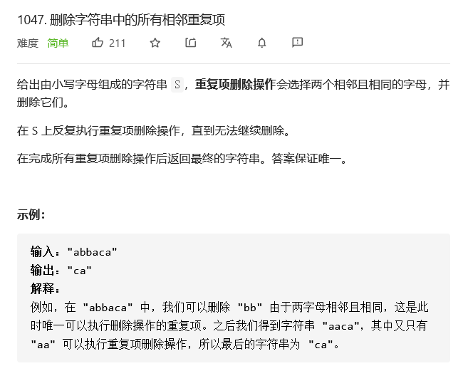

# LeetCode-Solutions
My own solutions of leetcode
## 题目总结
#### 1047


* 每次遍历找到重复字母，删除后循环，O(n^2)
* 用栈来遍历字符串，入栈元素与栈顶比较，相同出栈一个字母否则入栈一个字母，最终的栈即为答案，O^(n)

#### 92
反转链表(表内任意区间)：
* 遍历一次，O(n)
* 三个指针，注意边界处理(首尾的NULL结点)
* 返回时head可能改变


## 通用总结
1. (py) 在已知区间长度时用 `for` 比 `while` 快，快在循环入口的判断部分
```py
length = 8
#1
cnt = 0
while cnt < 8:
    cnt = cnt + 1
    ...
#2
for _ in range(length):
    ...
#2 is faster than #1
```